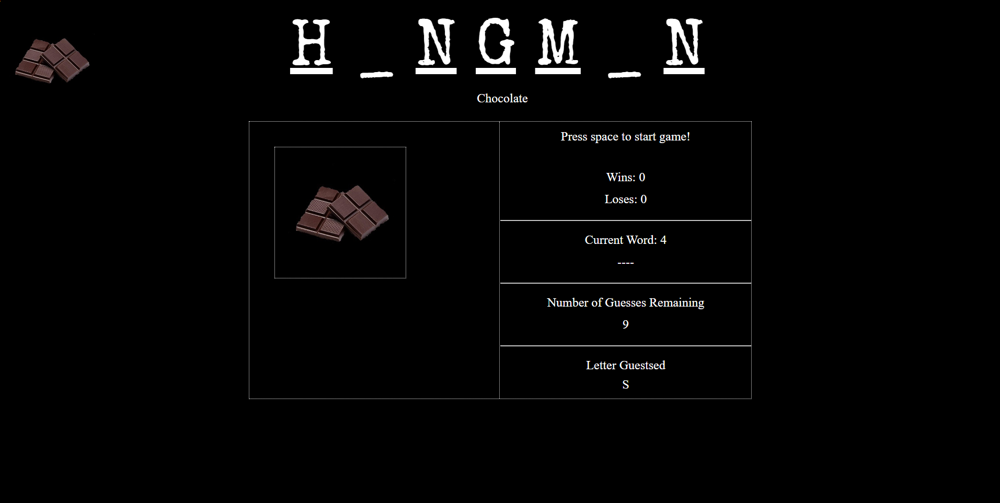

# word-guess

## Description: You are given a random word only seeing the _ character and you have to guess the letter

## How it is organaize:
### You click on a letter to start
### you try to guess the letter
### you are given a point if the word is guessed

## How to run the app:
### 1. Git clone this repo
### 2. open index.html in your browser

### You can view the app here
### https://armjim14.github.io/word-guess/

## Home page

